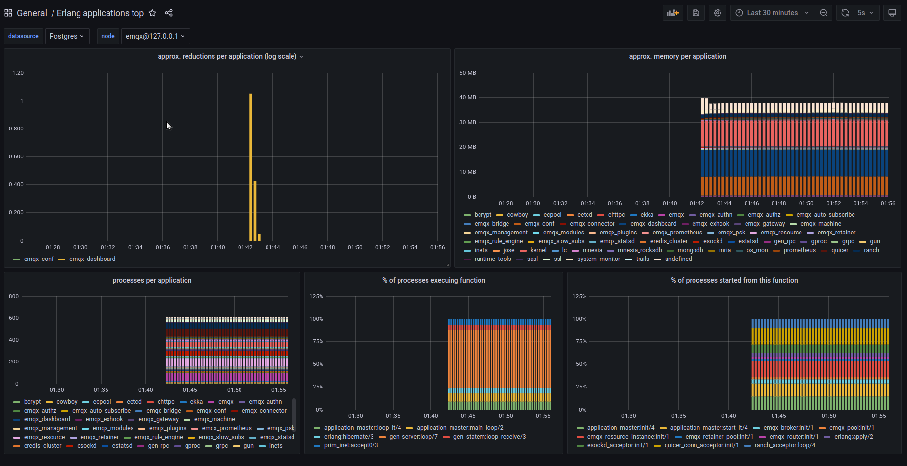

# system_monitor
> Erlang telemetry collector

`system_monitor` is a BEAM VM monitoring and introspection application
that helps troubleshooting live systems. It collects various
information about Erlang processes and applications.
Unlike `observer`, `system_monitor` does not require
connecting to the monitored system via Erlang distribution protocol,
and can be used to monitor systems with very tight access
restrictions.

## Features

### Process top

Information about top N Erlang processes consuming the most resources
(such as reductions or memory), or have the longest message queues, is
presented on process top dashboard:


Historical data can be accessed via standard Grafana time
picker. `status` panel can display important information about the
node state. Pids of the processes on that dashboard are clickable
links that lead to the process history dashboard.

### Process history


Process history dashboard displays time series data about certain
Erlang process. Note that some data points can be missing if the
process didn't consume enough resources to appear in the process top.

### Application top


Application top dashboard contains various information aggregated per
OTP application.

## Usage example

In order to integrate `system_monitor` into your system, simply add it
to the release apps. Add the following lines to `rebar.config`:

```erlang
{deps, [..., system_monitor]}.

{relx,
 [ {release, {my_release, "1.0.0"},
    [kernel, sasl, ..., system_monitor]}
 ]}.
```

### Custom node status

`system_monitor` can export arbitrary node status information that is
deemed important for the operator. This is done by defining a callback
function that returns an HTML-formatted string (or iolist):

```erlang
-module(foo).

-export([node_status/0]).

node_status() ->
  ["my node type<br/>",
   case healthy() of
     true  -> "<font color=#0f0>UP</font><br/>"
     false -> "<mark>DEGRADED</mark><br/>"
   end,
   io_lib:format("very important value=~p", [very_important_value()])
  ].
```

This callback then needs to be added to the system_monitor application
environment:

```erlang
{system_monitor,
   [ {node_status_fun, {foo, node_status}}
   ...
   ]}
```

More information about configurable options is found [here](src/system_monitor.app.src).

## How it all works out

System_monitor will spawn several processes that handle different states:

* `system_monitor_collector`
  Collects a certain amount of data from BEAM for a preconfigured number of processes
* `system_monitor_events`
  Subscribes to certain types of preconfigured BEAM events such as: busy_port, long_gc, long_schedule etc
* `system_monitor`
  Runs periodically a set of preconfigured `monitors`

### What are the preconfigured monitors

* `check_process_count`
  Logs if the process_count passes a certain threshold
* `suspect_procs`
  Logs if it detects processes with suspiciously high memory
* `report_full_status`
  Gets the state from `system_monitor_collector` and produces to a backend module
  that implements the `system_monitor_callback` behavior, selected by binding
  `callback_mod` in the `system_monitor` application environment to that module.
  If `callback_mod` is unbound, this monitor is disabled.
  The preconfigured backend is Postgres and is implemented via `system_monitor_pg`.

`system_monitor_pg` allows for Postgres being temporary down by storing the stats in its own internal buffer.
This buffer is built with a sliding window that will stop the state from growing too big whenever
Postgres is down for too long. On top of this `system_monitor_pg` has a built-in load
shedding mechanism that protects itself once the message length queue grows bigger than a certain level.

## Release History

See our [changelog](CHANGELOG.md).

## License

Copyright © 2020 Klarna Bank AB
Copyright © 2021-2022 k32

For license details, see Klarna Bank ABthe [LICENSE](LICENSE) file in the root of this project.
